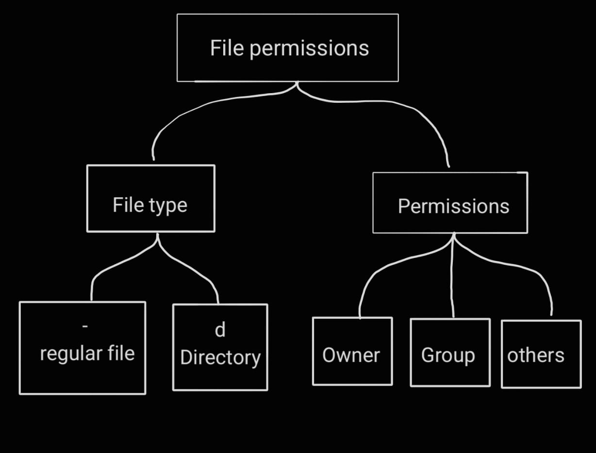
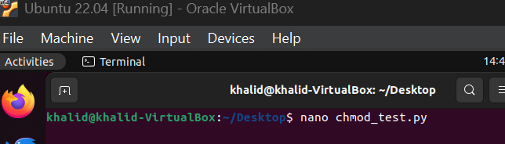
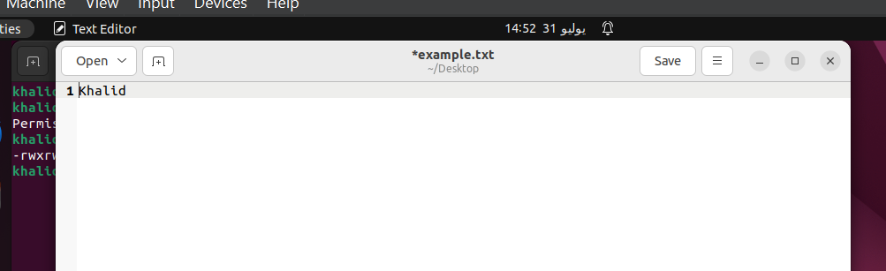
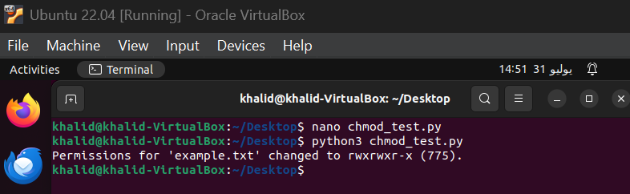
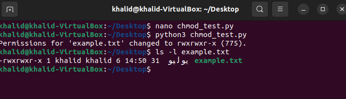

## 🔐 Linux File Permissions - Explained and Automated with Python

This project demonstrates how Linux file permissions work and how to change them programmatically using Python. It includes a flowchart, permission breakdown, and a script to set permissions to rwxrwxr-x (775).

---

## 🧠 Understanding File Permissions

A typical Linux file permission looks like this:

rwxrwxr-x


| Section      | Meaning                       |
|--------------|-------------------------------|
| r = 4      | Read                          |
| w = 2      | Write                         |
| x = 1      | Execute                       |

### 🔍 Breakdown

- **Owner** → rwx → Full control (4+2+1 = 7)
- **Group** → rwx → Full control (7)
- **Others** → r-x → Read + execute only (4+1 = 5)

**Total numeric equivalent**: 775

---

## 📊 Flowchart
<br/>  </div>


## 🐍 The Python Example

I created a Python file on VirtualBox inside Ubuntu by writing a simple script in the terminal.  
The script writes my name into a file called `example.txt`.

<div align="center">  
    
  <br/>  
    
</div>

After that, I ran the code and used the `ls -l` command to check whether the file permissions were changed or not.

<div align="center">  
    
  <br/>  
    
</div>


---
## the code 
```
import os

file_path = "example.txt"
with open(file_path, "w") as file:
    file.write("Khalid")

os.chmod(file_path, 0o775)

print(f"Permissions for '{file_path}' changed to rwxrwxr-x (775)
```
